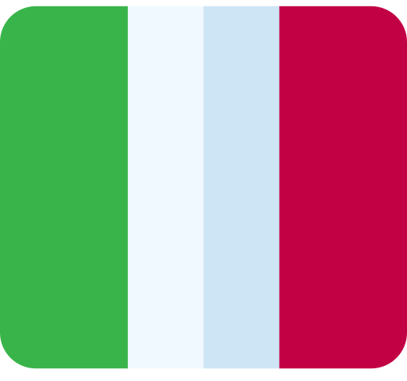
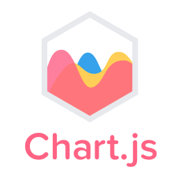

# Gabriel Carrasco
### Front-end Developer | UI/UX Enthusiast | Web Designer

## 👨‍💻 About Me

I'm a passionate Front-end Developer from Peru 

currently based in Italy

- 🔭 I specialize in creating responsive and user-friendly web applications
- 🌱 Currently diving deep into advanced JavaScript concepts and modern frameworks
- 💡 I love turning complex problems into simple, beautiful, and intuitive designs
- 🎯 Goals: Contributing to Open Source projects and expanding my TypeScript expertise
- 💬 Ask me about **Frontend Development**, **UI/UX Design**, and **Web Accessibility**

## 🛠️ Technical Skills

### 💻 Programming Languages & Frameworks

### 📊 Data Visualization & Template Engines

### 🔧 Development & DevOps Tools

### 🎨 Design & Project Management

## 📊 GitHub Statistics

  
📊 GitHub Profile Stats

   
  
  
  
  
  
  

  
🏆 GitHub Trophies

   
  
  

## 🤝 Let's Connect

## 📝 Latest Blog Posts
<!-- BLOG-POST-LIST:START -->
- [Coming soon...]()
<!-- BLOG-POST-LIST:END -->

---

  

💙 If you like my projects, Give them ⭐ and Share them!

[in]:https://www.linkedin.com/in/gabriel-carrasco-667562117 "Linkedin profile"
[outlook]:mailto:gabriel136@hotmail.it "My email"
[instagram]:https://www.instagram.com/ "Instagram"
