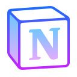

### I'm very pleased to meet you :v:

I'm Gabriel Carrasco a front-end developer from perù

and live in italy

Here are some ideas to get you started:

- :telescope:  I’m currently working on Web Responsive Pages

- :seedling: I’m currently learning Javascript in deep

- :mailbox_with_mail: Ask me about Frontend and Design

- :trophy: Projects in Codepen

## Find me in :

[][in]
[][outlook]
[][instagram]

 

## Tecnologies

<!--  -->

## Tools

## DevOps

## Plan

## Design

  

    

    

<!-- [][hub-stat]

  -->

<!--  -->

 
 

  

[in]:https://www.linkedin.com/in/gabriel-carrasco-667562117 "Linkedin profile"
[outlook]:mailto:gabriel136@hotmail.it "My email"
[instagram]:https://www.google.it "Instagram"
[hub-stat]:(https://github.com/Mkgabri18/github-readme-stats)

<!--

Icons made by <a href="https://www.flaticon.com/authors/freepik" title="Freepik">Freepik</a> from <a href="https://www.flaticon.com/" title="Flaticon">www.flaticon.com</a>
			

-->
