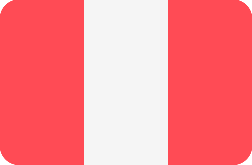

### I'm very pleased to meet you :v:

	

		<h2>
			I'm Gabriel Carrasco  
			front-end developer from Perù
			
			and live in Italy
			
		</h2>
		 

Here are some ideas to get you started:

- :telescope:  I’m currently working on Web Responsive Pages

- :seedling: I’m currently learning Javascript in deep

- :mailbox_with_mail: Ask me about Frontend and Design

- :trophy: Projects in Codepen
	

	<svg fill="none" viewBox="0 0 800 400" width="800" height="400" xmlns="http://www.w3.org/2000/svg">
		<foreignObject width="100%" height="100%">
			

				
				

					<h1>Made with HTML &amp; CSS not an animated GIF</h1>
					
Click to see the source

				

			

		</foreignObject>
	</svg>

 

## Tecnologies

## Tools

## DevOps

## Plan

## Design

## Find me in :

[][in]
[][outlook]
[][instagram]

## Code Activity

[][hub-stat]

 

  

[in]:https://www.linkedin.com/in/gabriel-carrasco-667562117 "Linkedin profile"
[outlook]:mailto:gabriel136@hotmail.it "My email"
[instagram]:https://www.google.it "Instagram"
[hub-stat]:(https://github.com/Mkgabri18/github-readme-stats)

<!--

Icons made by <a href="https://www.flaticon.com/authors/freepik" title="Freepik">Freepik</a> from <a href="https://www.flaticon.com/" title="Flaticon">www.flaticon.com</a>
			

-->

